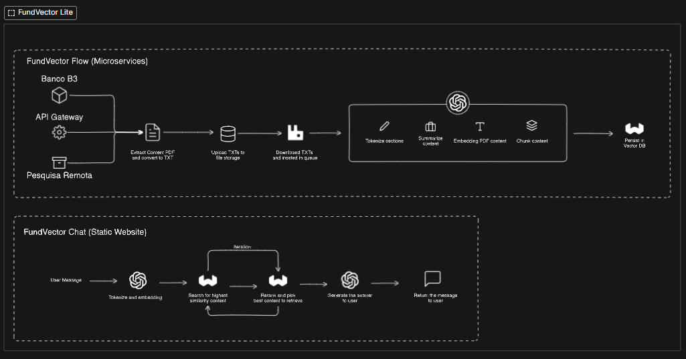
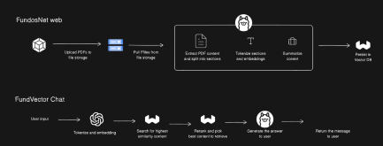
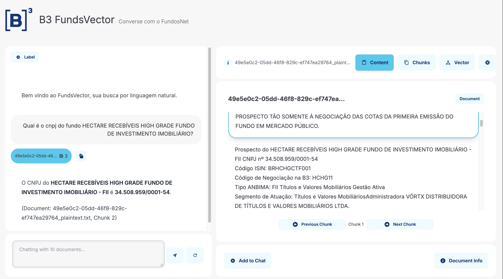

# FundsVector



## Problema

### Contexto

#### Plataforma de documentos de fundos.
Desenvolvido pela B3, por meio de convênio firmado com a CVM e ANBIMA, o sistema FundosNet é o
canal de entrega, simultânea, de documentos e informações periódicas ou eventuais à CVM e à entidade
administradora de mercado organizado se aplicando a:
 - Fundos de Investimento Imobiliário (“FII”);
 - Fundos de Investimento em Índice de Mercado (“ETF” e “ETF RF”);
 - Certificados de Recebíveis do Agronegócio (“CRA”); e
 - Certificados de Recebíveis Imobiliário (“CRI”).

Os documentos entregues no sistema são classificados em Categorias, Tipos e Espécies, aqui
denominadas associações. Estas associações são utilizadas nos mecanismos de busca de informação pelo
público interessado.

O sistema conta com dois grupos de documentos, a saber: Estruturados e Não Estruturados.
 - **Estruturados**: são aqueles cuja confecção decorre de tela padronizada ou formulário pré-
definido a ser preenchido seguindo os modelos disponibilizados pela CVM ou B3; por isso, a
denominação Estruturados.
 - **Não Estruturados** são aqueles cuja confecção é de livre criação das instituições
administradoras, tais como, editais de convocação, atas de assembleias, fatos relevantes,
comunicado ao mercado e prospectos. Estes documentos não estruturados são entregues
sempre em arquivos PDF

#### Cenário atual
Quando esta forma de classificação de documentos em associações (categoria, tipo e espécie) foi pensada
esperava-se tornar mais intuitivo o acesso e a busca pela informação, contribuindo para o aumento de
interesse por esses veículos de investimento. Porém, o que temos hoje é a dispersão da informação nos
vários documentos entregues na plataforma.

Por exemplo, caso um investidor queira saber qual o fundo foi
mais rentável durante o ano de 2023, não há outra forma se não abrir o informe de cada fundo e verificar a sua rentabilidade.

Se este mesmo investidor quiser saber quais fundos de investimento possuem liquidez
diária, não há outra forma de obter esta informação que não seja abrir o regulamento de cada fundo. Ou
ainda, se o desejo for de obter informações quais fundos possuem a menor taxa de administração, ou a
menor taxa de performance; para todos estes casos a única forma de obter esta informação é olhar o
prospecto e o regulamento de cada fundo.

Como se vê, a informação existe, mas ela está dispersa e a sua obtenção quase sempre é trabalhosa e
dispendiosa. O objetivo deste trabalho é facilitar a obtenção da informação, de forma que ela esteja
disponível ao investidor no menor tempo possível e com o menor esforço.

### Desafio
Desenvolver um novo motor de busca dentro do FundosNet, no qual o usuário informará em linguagem
natural o que deseja e o sistema se encarregará de interpretar o pedido, colher as informações nas bases
de dados estruturadas e não estruturadas e montar a resposta ao usuário.

## Objetivo
Tornar o acesso às informações e documentos relacionados a Fundos e Certificados mais ágil e intuitivo através de uma busca simplificada em linguagem natural, contribuindo assim para o aumento do interesse por esses veículos de investimento.

### Simplificada como?
Engaje-se em conversas com uma variedade de documentos, obtendo acesso direto a desempenho dos fundos, fatos relevantes, comunicados ao mercado, prospectos e economize dezenas de horas em tempo de pesquisa.

### Eficiência nas buscas vetoriais
A busca vetorial proporciona grande economia de tempo, especialmente em consultas complexas. Enquanto buscas tradicionais podem levar 3 a 10 minutos, as buscas vetoriais respondem em 10 a 30 segundos, uma economia de até 95% do tempo. Além disso, a acurácia percebida aumenta de 70%-80% para 85%-95%, e o número de cliques é reduzido em até 90%, pois as respostas são mais diretas e precisas. Com essa eficiência, a busca vetorial se torna uma ferramenta poderosa para otimização de pesquisas, especialmente para consultas avançadas.

## Pilares da Solução
Usamos ui generativa para criar interfaces conversacionais ricas,transformers para entender profundamente as consultas dos usuários,e banco de dados vetorial para recuperação de dados rápida e precisa.

# Arquitetura 



## Scaffold

```
src/
├── CrewAi/
├── Libraries/
├── carga-chunk-text/
├── carga-delete-folder/
├── carga-download-file/
├── carga-embed-flow/
├── carga-extract-llama/
├── carga-insert-vector/
├── carga-upload-cloud/
├── fila-gerenciador/
└── verba/
```

## Serviços

### download-file

Inserção do link do PDF no banco de dados SQL e início do processo de download do documento. Este serviço é responsável por obter os documentos originais que serão processados pelo sistema RAG (Retrieval Augmented Generation) baseado no Verba e no banco de dados vetorial Weaviate.

### extract-pdf

Extração do conteúdo do PDF e conversão em markdown utilizando a API Parser do LlamaIndex. A extração em markdown é crucial para preservar a estrutura do documento, facilitando a indexação e a recuperação de informações pelo modelo RAG.


### upload-cloud

Upload do conteúdo em markdown para um bucket no Google Cloud Platform (GCP). O armazenamento em nuvem garante que os dados estejam acessíveis e seguros para os processos subsequentes.

### delete-folder

Exclui a pasta temporária que armazenava o PDF e seus arquivos relacionados após a conclusão do upload, liberando espaço e mantendo a organização do sistema.


### Queue rabbitmq

Serviço de mensageria que orquestra o fluxo de dados entre os componentes do sistema. As mensagens são enfileiradas para os seguintes processos:


#### chunk-text

Faz o download do conteúdo markdown do PDF a partir do bucket no GCP, segmenta o texto em chunks baseados na estrutura do markdown e insere uma nova mensagem na fila `embed-flow`. A segmentação é essencial para a eficiência da indexação vetorial.

#### embed-flow

Recebe cada chunk e gera embeddings utilizando modelos avançados como o GPT-4. Os embeddings capturam a semântica dos textos, permitindo buscas vetoriais eficazes. Em seguida, envia os embeddings para a fila `insert-vector`.


#### insert vector
Insere os embeddings no banco de dados vetorial Weaviate. Este serviço finaliza o pipeline de processamento, tornando os dados prontos para serem utilizados pelo sistema RAG em consultas de linguagem natural.

### Verba
Camada responsável por fornecer uma interface gráfica otimizada para consultar os dados 

#### Captura de tela do MVP


## Próximos Passos
Como parte da evolução contínua da nossa solução, planejamos testar a GraphRAG da Microsoft. A GraphRAG combina grafos de conhecimento com modelos de linguagem avançados para melhorar a recuperação de informações e a geração de respostas contextualizadas. A documentação está disponível em https://microsoft.github.io/graphrag/. Este teste nos permitirá avaliar como a integração de grafos pode aprimorar ainda mais a precisão e a relevância das respostas fornecidas aos usuários.
